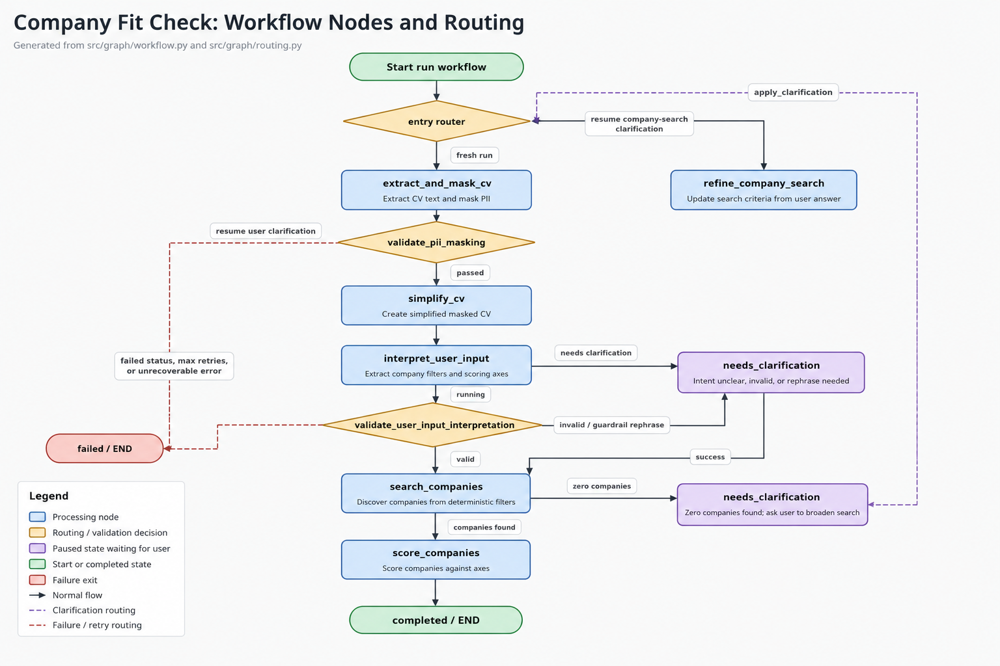
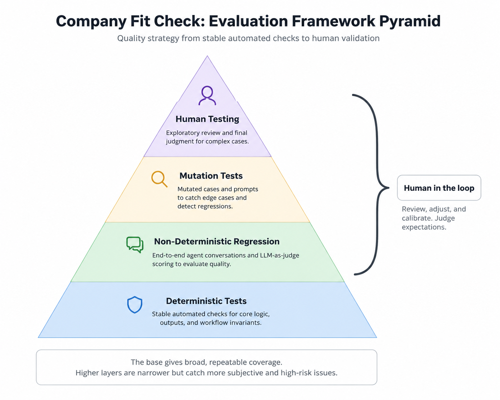
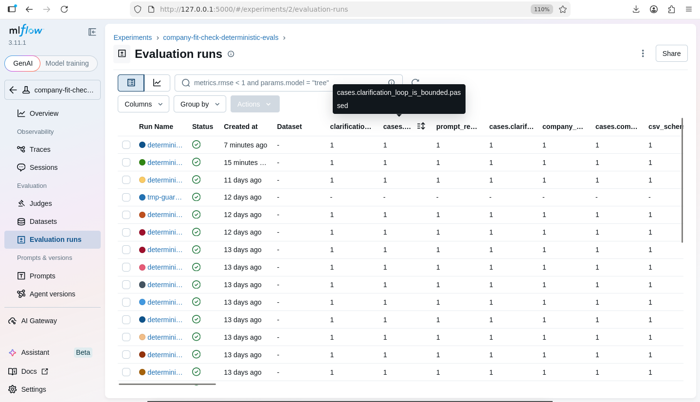
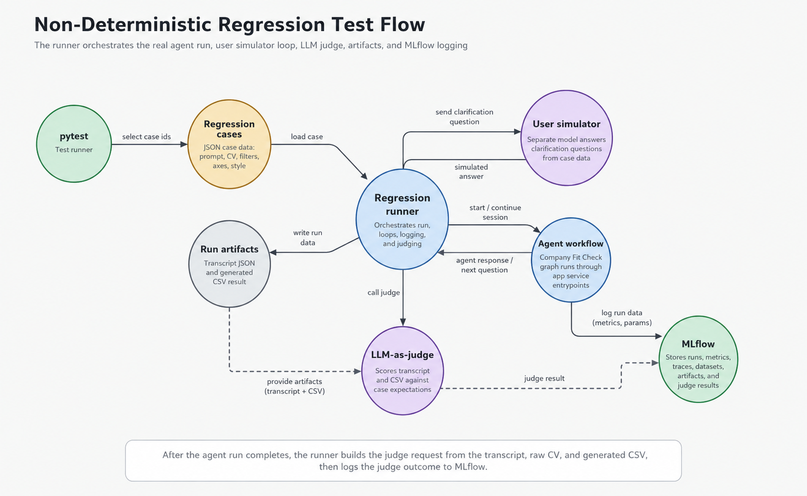
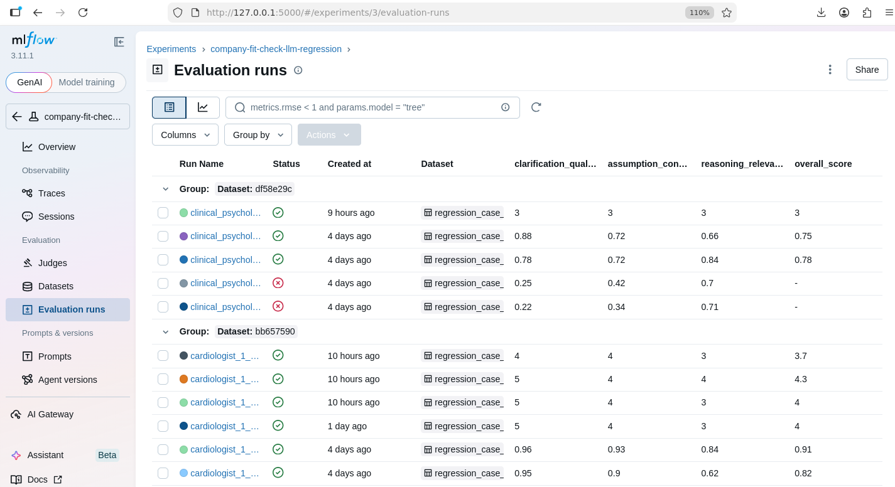

# Executive Summary

`company-fit-check` is a project with two connected parts. The first is the agent itself. The second is a full-cycle evaluation framework
used to validate and measure agent quality.

The agent is designed for a user who wants to explore companies aligned with
their professional background, goals, and interests without wasting time on
random search or random outreach. The user provides their background and goals,
the agent helps identify relevant companies, and the resulting company list can
be used to guide more targeted networking or outreach through LinkedIn or other
channels toward people with similar professional interests.

The evaluation framework exists to keep that agent useful, safe, and efficient.
It covers the full workflow from deterministic checks of stable system behavior
to end-to-end regression conversations with a user simulator, artifact
generation, LLM-based quality judgment, and mutation tests to catch edge cases
and validate evaluation strength more deeply.

## Architecture

The diagram below shows the current agent workflow architecture and routing
logic.



## Technical Stack

- Python - main programming language for the agent, workflow, services, and
  evaluation framework.
- LangGraph - graph orchestration layer for agent nodes, routing, resume logic,
  clarification loops, and terminal states.
- LangChain - chat model integration layer used by the workflow services.
- Azure OpenAI - hosted LLM provider for CV simplification, user-input
  interpretation, company discovery, company scoring, and LLM judge calls.
- Microsoft Foundry AI - model hosting path for the user simulator, including
  Anthropic Foundry integration.
- Chainlit - lightweight chat UI interface for interactive user sessions.
- MLflow - experiment tracking, traces, metrics, and workflow artifacts for
  deterministic and regression evaluation runs.
- Azure Blob Storage - remote artifact storage for MLflow-backed runs when
  configured.
- Microsoft Presidio - local PII detection and anonymization before CV text is
  sent into LLM-powered workflow steps.
- pytest - deterministic evaluation execution and regression test support.

## How to Run

In the near future, Company Fit Check is expected to be hosted in Azure and made
available publicly, so users will not need to run the project locally. Until
then, you can run it on your machine with your own Azure OpenAI model
deployment.

Create a virtual environment and install the project dependencies:

```bash
python3 -m venv .venv
source .venv/bin/activate
python3 -m pip install -e .
```

Create a local `.env` file with your model configuration:

```bash
AZURE_OPENAI_API_KEY=your-api-key
AZURE_OPENAI_ENDPOINT=https://your-resource.openai.azure.com/
AZURE_OPENAI_DEPLOYMENT=your-deployment-name
AZURE_OPENAI_API_VERSION=2024-02-15-preview
AZURE_OPENAI_TEMPERATURE=0
AZURE_OPENAI_MAX_TOKENS=5000
```

To enable MLflow monitoring, add the tracking configuration to the same `.env`
file. If these values are omitted, the app uses a local `.mlruns` tracking
directory by default.

```bash
MLFLOW_TRACKING_URI=file:///absolute/path/to/company-fit-check/.mlruns
MLFLOW_EXPERIMENT_NAME=company-fit-check
MLFLOW_REGRESSION_EXPERIMENT_NAME=company-fit-check-llm-regression
MLFLOW_MUTATION_EXPERIMENT_NAME=company-fit-check-llm-mutation
MLFLOW_ARTIFACT_ROOT=
AZURE_STORAGE_CONNECTION_STRING=
```

For Azure-backed artifact storage, set `MLFLOW_ARTIFACT_ROOT` to the remote
artifact location and provide `AZURE_STORAGE_CONNECTION_STRING`. Local runs can
leave both values empty.

Start the MLflow monitoring UI in a separate terminal with
[start_mlflow_ui.sh](https://github.com/RushenKottie/company-fit-check/blob/main/start_mlflow_ui.sh):

```bash
source .venv/bin/activate
./start_mlflow_ui.sh
```

By default, the MLflow UI is available at `http://127.0.0.1:5000`. You can
override the host or port with `MLFLOW_UI_HOST` and `MLFLOW_UI_PORT`.

Run the Chainlit chat interface with
[src/interfaces/chainlit/app.py](https://github.com/RushenKottie/company-fit-check/blob/main/src/interfaces/chainlit/app.py):

```bash
chainlit run src/interfaces/chainlit/app.py
```

Then open the local Chainlit URL shown in the terminal, upload a CV PDF, and
send the initial prompt describing the user's background, goals, and preferred
company direction.

## Evaluation

The diagram below shows the evaluation framework pyramid, from deterministic
coverage through human review.



### Evaluation Framework Engine and Visualization

The evaluation engine was built from scratch as a deliberate tradeoff. The
project and evaluation scope are still small, so adding a dedicated platform
such as LangSmith would create extra integration overhead before it is needed.

For the current scale, MLflow provides enough visibility: it records evaluation
runs, test results, traces, metrics, and artifacts, and makes it possible to
inspect and compare outcomes across runs.

If the project grows and the evaluation suite starts covering more agent
features, the next step should be a dedicated LLM evaluation and observability
platform. LangSmith is a natural fit for LangGraph and LangChain workflows, and
Arize Phoenix is also applicable because it supports LLM tracing, datasets,
experiments, and LLM-based evaluations.

### Evaluation Framework Engine: Deterministic Layer

The deterministic layer is based on code validations. It verifies stable
behavior that should not depend on LLM creativity or judge interpretation. Test
cases live in
[eval_data/deterministic_cases](https://github.com/RushenKottie/company-fit-check/tree/main/eval_data/deterministic_cases)
as JSON files. Each case defines
the entrypoint to execute, setup data, optional stubs, clarification replies,
and the checks that must pass.

The core execution logic is in
[src/evals/engine.py](https://github.com/RushenKottie/company-fit-check/blob/main/src/evals/engine.py).
It loads the requested case, prepares workflow input or state snapshots, applies
deterministic stubs from
[src/evals/stubs.py](https://github.com/RushenKottie/company-fit-check/blob/main/src/evals/stubs.py),
runs the workflow, node, or helper entrypoint, and captures the resulting state,
spans, artifacts, and errors. The code-based assertions live in
[src/evals/checks.py](https://github.com/RushenKottie/company-fit-check/blob/main/src/evals/checks.py),
where each named check validates one expected property such as PII masking,
guardrail behavior, bounded clarification loops, score payload shape, or CSV
schema.

The pytest entrypoint is
[tests/evals/test_deterministic_suite.py](https://github.com/RushenKottie/company-fit-check/blob/main/tests/evals/test_deterministic_suite.py).
It loads all deterministic cases, runs their requested checks, records metrics
and artifacts to MLflow, and fails the suite if any required check fails.

Run the deterministic layer with:

```bash
pytest tests/evals/test_deterministic_suite.py
```

Visual reference from the deterministic evaluation report in MLFlow:



### Evaluation Framework Engine: Non-Deterministic Regression Layer

The non-deterministic regression layer validates full agent conversations where
LLM behavior can vary between runs. Test cases live in
[eval_data/non_deterministic_regression](https://github.com/RushenKottie/company-fit-check/tree/main/eval_data/non_deterministic_regression)
as JSON files. Each case defines the
simulated user's profession, background, first prompt, target filters, scoring
axes, and communication style.



The core runner is
[src/evals/regression_runner.py](https://github.com/RushenKottie/company-fit-check/blob/main/src/evals/regression_runner.py).
It is the central orchestrator for the regression lifecycle: it loads the
selected cases, starts a real workflow session through the same Chainlit service
entrypoints used by the app, coordinates the clarification loop with the user
simulator, writes the transcript and generated CSV artifacts, calls the
LLM-as-judge step, and logs run data, traces, artifacts, and judge results into
the MLflow regression experiment. The user simulation logic lives in
[src/user_simulator/service.py](https://github.com/RushenKottie/company-fit-check/blob/main/src/user_simulator/service.py),
and the LLM-as-judge quality evaluation lives in
[src/evals/judge.py](https://github.com/RushenKottie/company-fit-check/blob/main/src/evals/judge.py).

**User simulator** is a component that simulates user behavior
when the agent asks clarification questions. It calls a separate model with the
case data, communication style, first prompt, and latest agent message, using a
higher temperature so replies are more variable while still staying grounded in
the case definition.

**Judging system** is configured in
[src/evals/judge.py](https://github.com/RushenKottie/company-fit-check/blob/main/src/evals/judge.py),
where the judge system prompt, metric names, and rubrics are defined. The
current metrics are `clarification_quality`, `assumption_control`, and
`reasoning_relevance_constraint_alignment`. For each completed regression run,
the runner sends the initial prompt, raw CV text, transcript, generated CSV, and
rubrics to the judge model and expects structured scores from 1 to 5, where 1
means clear failure, 3 means acceptable, and 5 means excellent. The threshold is
defined in
[src/evals/regression_runner.py](https://github.com/RushenKottie/company-fit-check/blob/main/src/evals/regression_runner.py):
if any component score is below 3, the run is marked as a judge-threshold
failure; otherwise the overall score is the average of the component scores.

The pytest entrypoint is
[tests/evals/test_llm_regression_runner.py](https://github.com/RushenKottie/company-fit-check/blob/main/tests/evals/test_llm_regression_runner.py).
It runs the configured regression cases, verifies that each conversation
completes, and then relies on the regression runner to judge and log the result.

Run the full regression layer with:

```bash
pytest tests/evals/test_llm_regression_runner.py
```

Run selected regression cases with:

```bash
pytest tests/evals/test_llm_regression_runner.py --case-ids 1,8
```

Run selected regression cases concurrently with:

```bash
pytest tests/evals/test_llm_regression_runner.py --case-ids 1,8 --concurrent --max-workers 2
```

This layer requires both the agent Azure OpenAI deployment and the user
simulator Foundry deployment to be configured in `.env`. The LLM judge uses the
main Azure OpenAI deployment by default unless `LLM_JUDGE_AZURE_OPENAI_*`
settings are provided.

Visual reference from the non-deterministic regression report in MLflow:



### Evaluation Framework Engine: Mutation Tests Layer

The mutation tests layer validates the agent against freshly generated
non-deterministic cases. Instead of using a fixed JSON fixture set, it builds a
small suite at runtime from bucket definitions in
[eval_data/mutation_tests/buckets.json](https://github.com/RushenKottie/company-fit-check/blob/main/eval_data/mutation_tests/buckets.json).
The buckets contain professions, experience patterns, goals, regions, company
filters, scoring axes, and communication-style traits. Each generated case also
gets a fictional CV PDF and a first prompt that asks for a random number of
companies between 5 and 50.

The case generator is
[src/evals/mutation_case_generator.py](https://github.com/RushenKottie/company-fit-check/blob/main/src/evals/mutation_case_generator.py).
It samples compatible values from the buckets, writes generated case JSON files
under `artifacts/mutation_tests/generated_cases`, writes matching PDF fixtures
under `artifacts/mutation_tests/generated_pdfs`, and returns the generated case
paths to the pytest entrypoint. The generated cases use the same schema as the
non-deterministic regression cases, so they can reuse the same user simulator,
conversation runner, transcript artifacts, CSV output, and LLM-as-judge flow.

The pytest entrypoint is
[tests/evals/test_llm_mutation_cases.py](https://github.com/RushenKottie/company-fit-check/blob/main/tests/evals/test_llm_mutation_cases.py).
It generates the mutation cases for the current suite, loads them through the
non-deterministic case loader, runs them with the shared regression runner, and
expects each run to complete and produce a transcript. Results are logged to the
MLflow mutation experiment configured by `MLFLOW_MUTATION_EXPERIMENT_NAME`.

Run the mutation layer with:

```bash
pytest tests/evals/test_llm_mutation_cases.py
```

By default, the mutation layer generates 2 cases. Run a custom number of
mutation cases with:

```bash
pytest tests/evals/test_llm_mutation_cases.py --mutation-count 5
```

Run mutation cases concurrently with:

```bash
pytest tests/evals/test_llm_mutation_cases.py --mutation-count 5 --concurrent --max-workers 2
```

This layer requires the same live model configuration as the non-deterministic
regression layer: the agent Azure OpenAI deployment, the user simulator Foundry
deployment, and the LLM judge configuration. Mutation-test results should still
be manually validated, because the cases are generated dynamically and are not
tied to stable expected outputs.

## Backlog

This project is still in progress. Upcoming improvements, refinements, and
evaluation adjustments will be tracked and handled through GitHub Issues so the
work stays visible, scoped, and easy to prioritize. The current WIP milestone is
tracked in [Company Fit Check WIP Milestone 1](https://github.com/RushenKottie/company-fit-check/milestone/1).
