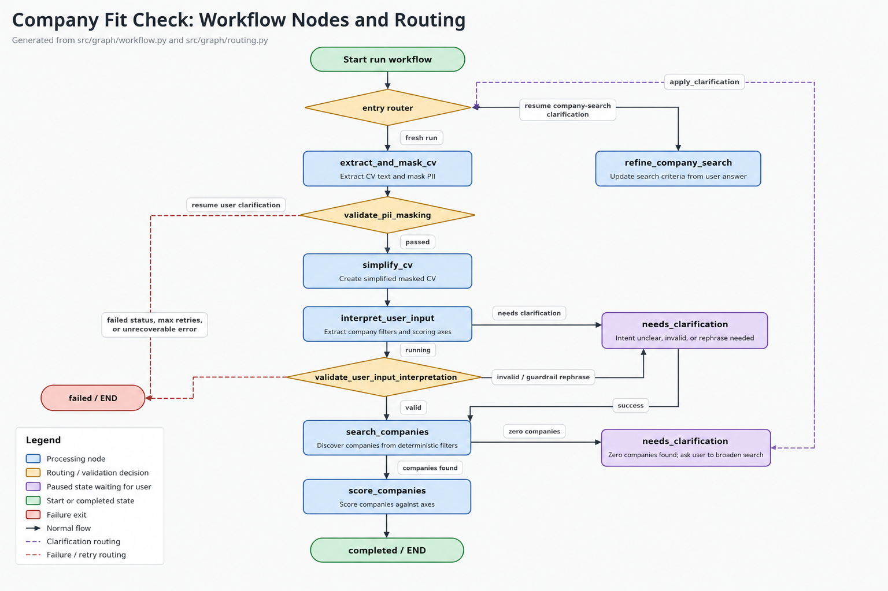
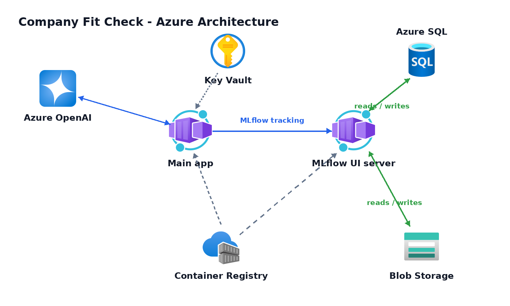
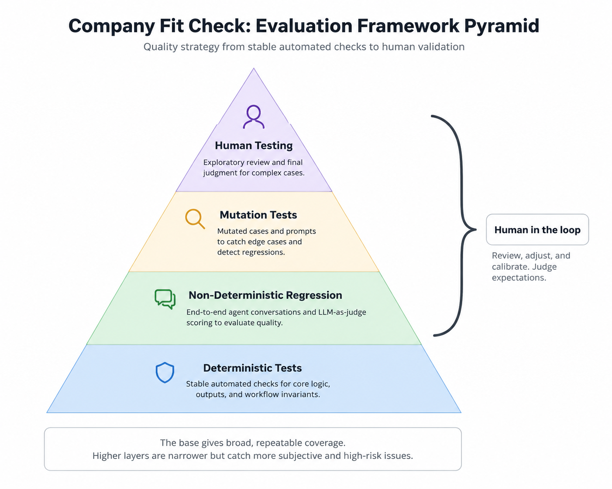
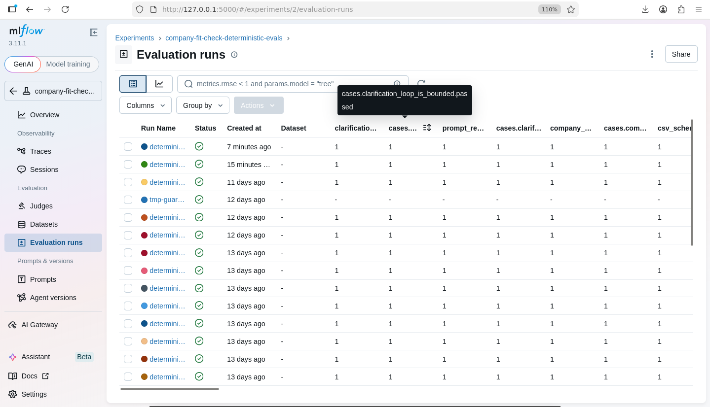
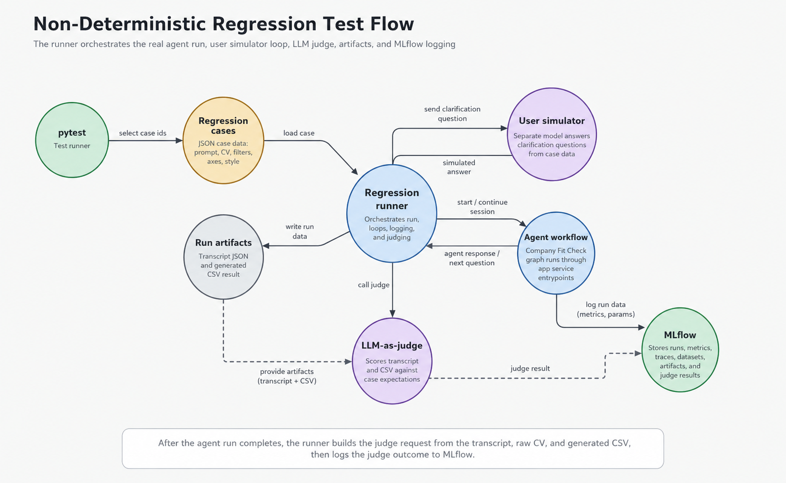
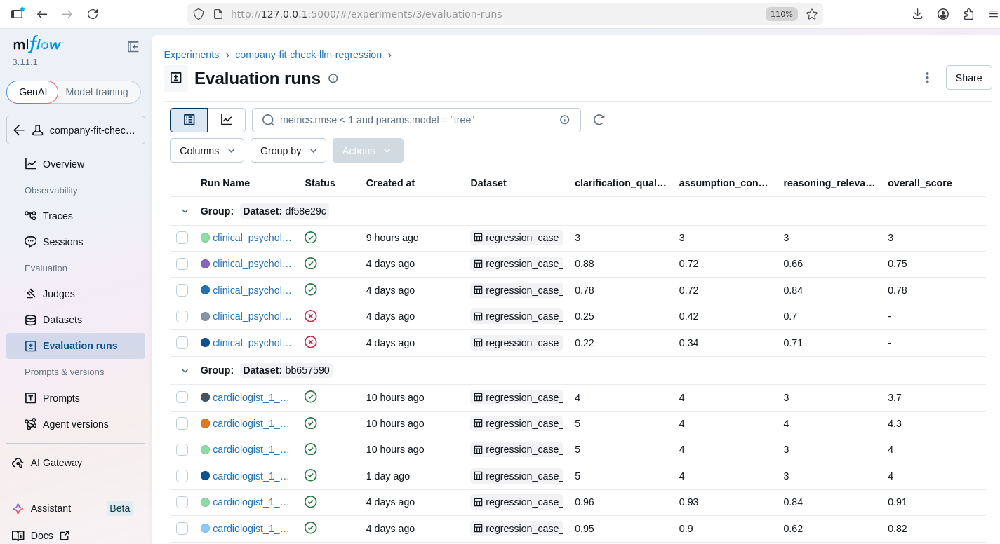

# Executive Summary

- Problem: Job seekers and professionals often waste time on broad company
  searches and untargeted outreach that do not reflect their background, goals,
  or interests.
- Solution: `company-fit-check` uses an agent to turn a user's background and
  goals into a focused company list, supported by a full-cycle evaluation
  framework that validates agent quality across deterministic checks,
  end-to-end regression conversations, LLM-based judgment, and mutation tests.
- Why it matters: The project helps users find more relevant companies and make
  better-targeted networking or outreach decisions while keeping the agent
  useful, safe, and efficient as it evolves.

## Architecture

The agent follows a guided workflow: it collects the user's CV and goals,
removes sensitive personal information, interprets the user's company
preferences, discovers and scores matching companies, and returns a structured
shortlist. LangGraph coordinates the workflow steps, including clarification
loops when the user input is incomplete.

The diagram below shows the current agent workflow architecture and routing
logic.



## Technical Stack

### Core Language

- Python - main programming language for the agent, workflow, services, and
  evaluation framework.

### Workflow and Tools

- LangGraph - graph orchestration layer for agent nodes, routing, resume logic,
  clarification loops, and terminal states.
- LangChain - chat model integration layer used by the workflow services.

### LLM Access

- Azure OpenAI - access layer for LLM calls used in CV simplification,
  user-input interpretation, company discovery, company scoring, and LLM judge
  evaluation.
- Microsoft Foundry AI - AI platform used to access and manage LLMs for the
  user simulator, including Anthropic Foundry integration.

### UI

- Chainlit - lightweight chat UI interface for interactive user sessions.

### Evaluation and Observability

- MLflow - experiment tracking, traces, metrics, and workflow artifacts for
  deterministic and regression evaluation runs.
- pytest - deterministic evaluation execution and regression test support.

### Privacy and Data Protection

- Microsoft Presidio - local PII detection and anonymization before CV text is
  sent into LLM-powered workflow steps.

## Code Structure

The codebase is organized around the agent workflow, the supporting services,
and the evaluation framework:

- `src/graph` - LangGraph workflow definition, node names, routing logic, and
  graph assembly.
- `src/application` - application-level workflow state, session handling,
  messages, transitions, policies, and exported results.
- `src/services` - domain services for PDF text extraction, PII masking, CV
  simplification, user-input interpretation, company discovery, and company
  scoring.
- `src/llm` - shared LLM client setup used by workflow services and evaluation
  components.
- `src/interfaces/chainlit` - Chainlit chat interface, session integration, and
  presentation helpers.
- `src/infrastructure` - MLflow tracking, artifact handling, tracing, and
  dataset management utilities.
- `src/evals` - deterministic, non-deterministic, mutation, and user-simulator
  evaluation logic.
- `eval_data` - evaluation cases, fixture CVs, saved workflow states, and
  mutation configuration.
- `img` - architecture and evaluation diagrams used in this README.
- `Dockerfile` - container image definition for the Chainlit application. The
  same image can also be used by Azure Container Apps Jobs for evaluation runs
  when the image is built with `tests` and `eval_data` included.
- `infra/mlflow-server/Dockerfile` - container image definition for the
  standalone MLflow tracking server.

## How to Run Locally

You can run Company Fit Check on your machine with your own Azure OpenAI model
deployment.

Create a virtual environment and install the project dependencies:

```bash
python3 -m venv .venv
source .venv/bin/activate
python3 -m pip install -e .
```

Create a local `.env` file with your model configuration:

```bash
AZURE_OPENAI_API_KEY=your-api-key
AZURE_OPENAI_ENDPOINT=https://your-resource.openai.azure.com/
AZURE_OPENAI_DEPLOYMENT=your-deployment-name
AZURE_OPENAI_API_VERSION=2024-02-15-preview
AZURE_OPENAI_TEMPERATURE=0
AZURE_OPENAI_MAX_TOKENS=5000
```

Add the MLflow tracking configuration to the same `.env` file.
`MLFLOW_TRACKING_MODE` is required and must be `local`, `azureml`, or `remote`.

```bash
MLFLOW_TRACKING_MODE=local
MLFLOW_TRACKING_URI=sqlite:////absolute/path/to/company-fit-check/.mlflow/mlflow.db
MLFLOW_EXPERIMENT_NAME=company-fit-check
MLFLOW_ARTIFACT_ROOT=wasbs://container@account.blob.core.windows.net/company-fit-check
AZURE_STORAGE_CONNECTION_STRING=your-blob-storage-connection-string
```

Local mode writes MLflow metadata to SQLite and artifacts to the configured
artifact root. Azure ML mode uses the Azure ML / Foundry tracking URI and Azure
managed artifact storage:

```bash
MLFLOW_TRACKING_MODE=azureml
MLFLOW_TRACKING_URI=azureml://...
MLFLOW_EXPERIMENT_NAME=company-fit-check
```

Remote mode uses a deployed MLflow tracking server. In this mode the app only
needs the tracking server URI; the remote server owns the backend store and
artifact storage configuration:

```bash
MLFLOW_TRACKING_MODE=remote
MLFLOW_TRACKING_URI=https://your-mlflow-container-app.azurecontainerapps.io
MLFLOW_EXPERIMENT_NAME=company-fit-check
```

Start the MLflow monitoring UI in a separate terminal with
[start_mlflow_ui.sh](https://github.com/RushenKottie/company-fit-check/blob/main/start_mlflow_ui.sh):

```bash
source .venv/bin/activate
./start_mlflow_ui.sh
```

By default, the MLflow UI is available at `http://127.0.0.1:5000`. You can
override the host or port with `MLFLOW_UI_HOST` and `MLFLOW_UI_PORT`.

Run the Chainlit chat interface with
[src/interfaces/chainlit/app.py](https://github.com/RushenKottie/company-fit-check/blob/main/src/interfaces/chainlit/app.py):

```bash
chainlit run src/interfaces/chainlit/app.py
```

Then open the local Chainlit URL shown in the terminal, upload a CV PDF, and
send the initial prompt describing the user's background, goals, and preferred
company direction.

## Azure Deployment and Evaluation Operations

The deployed app link is available upon request. The deployed environment is
built around Azure-native services, with the app and observability stack
separated so the user-facing workflow can evolve independently from the MLflow
tracking server.



### Main App Infrastructure

- Azure Container Apps hosts the main `company-fit-check` Chainlit application.
  The container listens on port `8000`, and the Container App ingress target port
  is `8000`.
- Azure Container Registry stores deployable container images for the main app
  and the standalone MLflow server.
- Azure Key Vault stores secrets such as Azure OpenAI credentials, MLflow backend
  connection strings, and Azure Storage credentials. Container Apps consume these
  through Key Vault-backed secret references.
- Azure Container Apps managed identity is used to grant Container Apps access
  to Key Vault secrets through the `Key Vault Secrets User` role.

### MLflow Infrastructure

- A separate Azure Container App hosts the MLflow tracking server. The container
  listens on port `5000`, and the Container App ingress target port is `5000`.
- The project uses a standalone MLflow server instead of Azure ML managed MLflow
  because the evaluation and observability workflows depend on the fuller MLflow
  UI experience: experiment comparison, trace inspection, metrics, run artifacts,
  prompts, transcripts, generated CSVs, and evaluation reports are all reviewed
  together there. Azure ML managed tracking is useful, but its UI surface is more
  limited for this project, so replacing the standalone server would remove
  observability features that the evaluation framework relies on.
- Azure SQL Database is used as the MLflow backend store for experiments, runs,
  metrics, params, tags, and trace metadata.
- Azure Blob Storage is used as the MLflow artifact store for transcripts,
  prompts, generated CSV files, evaluation reports, and other run artifacts.
- The MLflow server receives its backend and artifact configuration through
  environment variables such as `MLFLOW_BACKEND_STORE_URI`,
  `MLFLOW_ARTIFACTS_DESTINATION`, and `AZURE_STORAGE_CONNECTION_STRING`.
- The MLflow server also needs host/CORS configuration for the Container Apps
  hostname, using `MLFLOW_SERVER_ALLOWED_HOSTS` and
  `MLFLOW_SERVER_CORS_ALLOWED_ORIGINS`, so the MLflow security middleware does
  not reject valid browser or client requests.
- The main app connects to this server with `MLFLOW_TRACKING_MODE=remote` and an
  HTTPS `MLFLOW_TRACKING_URI`.

### AI Foundry

- Azure OpenAI provides the main model deployment used by CV simplification,
  preference interpretation, company discovery, company scoring, and the default
  LLM judge configuration.
- Microsoft Foundry AI is used for evaluation-time model access, including the
  user simulator flow and Anthropic Foundry integration.
- Judge-specific Azure OpenAI settings can be supplied with
  `LLM_JUDGE_AZURE_OPENAI_*`; otherwise the judge falls back to the main Azure
  OpenAI deployment.

### Evaluation Data Flow

- Deterministic, non-deterministic, and mutation evaluation runs execute from the
  same application workflow code used by the Chainlit app.
- Evaluation runs are executed as manual Azure Container Apps Jobs. Each job uses
  the same ACR image pattern as the deployed app and overrides the container
  command to run a pytest entrypoint instead of starting Chainlit.
- The evaluation job image must contain `tests` and `eval_data`, because the
  tests import the workflow modules directly and load repository-local fixtures.
  The application command still starts Chainlit, while the job command runs
  pytest against the same packaged code.
- Evaluation runs send traces, metrics, transcripts, generated CSVs, judge
  requests/results, and other artifacts to the remote MLflow server.
- The MLflow server writes structured tracking metadata to Azure SQL Database
  and larger artifacts to Azure Blob Storage.
- Evaluation outputs can then be inspected in the MLflow UI without depending on
  Azure ML managed MLflow tracking.

### Manual Azure Container Apps Evaluation Jobs

The Azure evaluation setup uses three separate manual Container Apps Jobs rather
than one combined command. Separate jobs avoid shell-argument parsing issues in
the portal, make logs easier to inspect, and allow deterministic, regression,
and mutation runs to be started independently.

The current job layout is:

| Job name | Command | Arguments |
| --- | --- | --- |
| `cfc-deterministic-evals` | `pytest` | `tests/evals/test_deterministic_suite.py` |
| `cfc-regression-evals` | `pytest` | `tests/evals/test_llm_regression_runner.py --concurrent --max-workers 2` |
| `cfc-mutation-evals` | `pytest` | `tests/evals/test_llm_mutation_cases.py --mutation-count 2` |

Regression and mutation jobs can be run concurrently inside the test runner, but
high worker counts increase memory pressure because multiple full workflow
sessions, MLflow artifacts, LLM calls, and judge requests are active in one
container. If a job exits with code `137`, treat it as a likely resource kill:
increase CPU/memory or reduce `--max-workers`.

Recommended job settings:

- Trigger type: manual.
- Workload profile: Consumption for short-lived manual runs.
- Initial resources: 4 CPU and 8 GiB memory for regression; smaller resources
  are usually enough for deterministic runs.
- Replica timeout: at least 3600 seconds for regression and mutation.
- Registry authentication: managed identity with `AcrPull` on the Azure
  Container Registry.
- Secret access: managed identity with `Key Vault Secrets User` on the Key
  Vault.

In Azure, sensitive values are stored as Container Apps Job secrets backed by
Key Vault references. The Python code reads environment variable names such as
`AZURE_OPENAI_API_KEY` and `USER_SIMULATOR_FOUNDRY_API_KEY`; the Key Vault
secret names may use Azure-friendly names such as `AZURE-OPENAI-API-KEY` and
`USER-SIMULATOR-FOUNDRY-API-KEY`.

The regression and mutation jobs are quality gates. A failed job does not always
mean the Azure job infrastructure is broken. If pytest reports
`judge_component_below_threshold`, the workflow completed but the LLM judge
scored at least one case below the configured threshold. Those failures should
be reviewed in MLflow using the transcript, generated CSV, judge request, judge
result, and component scores.

## Usage Examples

After uploading a CV PDF, the user can start with prompts such as:

- "I am a backend Python engineer interested in healthtech companies in Europe.
  Please find companies where my experience with APIs, data pipelines, and
  cloud deployment would be a strong fit."
- "I have a product management background and want to explore early-stage AI
  startups in the United States. Prioritize companies where I could work on
  developer tools or workflow automation."

The agent uses the CV and prompt together to interpret the user's goals,
identify relevant companies, score their fit, and produce a structured shortlist
for follow-up research or outreach.

## Evaluation

The diagram below shows the evaluation framework pyramid, from deterministic
coverage through human review.



### Evaluation Framework Engine and Visualization

The evaluation engine was built from scratch as a deliberate tradeoff. The
project and evaluation scope are still small, so adding a dedicated platform
such as LangSmith would create extra integration overhead before it is needed.

For the current scale, MLflow provides enough visibility: it records evaluation
runs, test results, traces, metrics, and artifacts, and makes it possible to
inspect and compare outcomes across runs.

If the project grows and the evaluation suite starts covering more agent
features, the next step should be a dedicated LLM evaluation and observability
platform. LangSmith is a natural fit for LangGraph and LangChain workflows, and
Arize Phoenix is also applicable because it supports LLM tracing, datasets,
experiments, and LLM-based evaluations.

### Evaluation Framework Engine: Deterministic Layer

The deterministic layer is based on code validations. It verifies stable
behavior that should not depend on LLM creativity or judge interpretation. Test
cases live in
[eval_data/deterministic_cases](https://github.com/RushenKottie/company-fit-check/tree/main/eval_data/deterministic_cases)
as JSON files. Each case defines
the entrypoint to execute, setup data, optional stubs, clarification replies,
and the checks that must pass.

The core execution logic is in
[src/evals/engine.py](https://github.com/RushenKottie/company-fit-check/blob/main/src/evals/engine.py).
It loads the requested case, prepares workflow input or state snapshots, applies
deterministic stubs from
[src/evals/stubs.py](https://github.com/RushenKottie/company-fit-check/blob/main/src/evals/stubs.py),
runs the workflow, node, or helper entrypoint, and captures the resulting state,
spans, artifacts, and errors. The code-based assertions live in
[src/evals/checks.py](https://github.com/RushenKottie/company-fit-check/blob/main/src/evals/checks.py),
where each named check validates one expected property such as PII masking,
guardrail behavior, bounded clarification loops, score payload shape, or CSV
schema.

The pytest entrypoint is
[tests/evals/test_deterministic_suite.py](https://github.com/RushenKottie/company-fit-check/blob/main/tests/evals/test_deterministic_suite.py).
It loads all deterministic cases, runs their requested checks, records metrics
and artifacts to MLflow, and fails the suite if any required check fails.

Run the deterministic layer with:

```bash
pytest tests/evals/test_deterministic_suite.py
```

Visual reference from the deterministic evaluation report in MLFlow:



### Evaluation Framework Engine: Non-Deterministic Layer

The non-deterministic layer validates full agent conversations where LLM
behavior can vary between runs. The hand-authored regression cases live in
[eval_data/non_deterministic_regression](https://github.com/RushenKottie/company-fit-check/tree/main/eval_data/non_deterministic_regression)
as JSON files. Each case defines the
simulated user's profession, background, first prompt, target filters, scoring
axes, and communication style.



The core runner is
[src/evals/nondeterministic/runner.py](https://github.com/RushenKottie/company-fit-check/blob/main/src/evals/nondeterministic/runner.py).
It is the central orchestrator for the non-deterministic lifecycle: it loads
the selected cases, starts a real workflow session through the shared
application session entrypoint, coordinates the clarification loop with the user
simulator, writes the transcript and generated CSV artifacts, calls the
LLM-as-judge step, and logs run data, traces, artifacts, and judge results into
MLflow. The user simulation logic lives in
[src/evals/user_simulator/service.py](https://github.com/RushenKottie/company-fit-check/blob/main/src/evals/user_simulator/service.py),
and the LLM-as-judge quality evaluation lives in
[src/evals/nondeterministic/judge.py](https://github.com/RushenKottie/company-fit-check/blob/main/src/evals/nondeterministic/judge.py).

**User simulator** is a component that simulates user behavior across the
regression conversation. It supplies the case's seeded first user prompt to
start the session, and when the agent asks clarification questions it calls a
separate model with the case data, communication style, first prompt, and latest
agent message, using a higher temperature so replies are more variable while
still staying grounded in the case definition.

**Judging system** is configured in
[src/evals/nondeterministic/judge.py](https://github.com/RushenKottie/company-fit-check/blob/main/src/evals/nondeterministic/judge.py),
where the judge system prompt, metric names, and rubrics are defined. The
current metrics are `clarification_quality`, `assumption_control`, and
`reasoning_relevance_constraint_alignment`. For each completed regression run,
the runner sends the initial prompt, raw CV text, transcript, generated CSV, and
rubrics to the judge model and expects structured scores from 1 to 5, where 1
means clear failure, 3 means acceptable, and 5 means excellent. The threshold is
defined in
[src/evals/nondeterministic/runner.py](https://github.com/RushenKottie/company-fit-check/blob/main/src/evals/nondeterministic/runner.py):
if any component score is below 3, the run is marked as a judge-threshold
failure; otherwise the overall score is the average of the component scores.

The pytest entrypoint is
[tests/evals/test_llm_regression_runner.py](https://github.com/RushenKottie/company-fit-check/blob/main/tests/evals/test_llm_regression_runner.py).
It runs the configured regression cases, verifies that each conversation
completes, and then relies on the non-deterministic runner to judge and log the
result.

Run the full regression layer with:

```bash
pytest tests/evals/test_llm_regression_runner.py
```

Run selected regression cases with:

```bash
pytest tests/evals/test_llm_regression_runner.py --case-ids 1,8
```

Run selected regression cases concurrently with:

```bash
pytest tests/evals/test_llm_regression_runner.py --case-ids 1,8 --concurrent --max-workers 2
```

This layer requires both the agent Azure OpenAI deployment and the user
simulator Foundry deployment to be configured in `.env`. The LLM judge uses the
main Azure OpenAI deployment by default unless `LLM_JUDGE_AZURE_OPENAI_*`
settings are provided.

Visual reference from the non-deterministic regression report in MLflow:



### Evaluation Framework Engine: Mutation Tests Layer

The mutation tests layer validates the agent against freshly generated
non-deterministic cases. Instead of using a fixed JSON fixture set, it builds a
small suite at runtime from bucket definitions in
[eval_data/mutation_tests/buckets.json](https://github.com/RushenKottie/company-fit-check/blob/main/eval_data/mutation_tests/buckets.json).
The buckets contain professions, experience patterns, goals, regions, company
filters, scoring axes, and communication-style traits. Each generated case also
gets a fictional CV PDF and a first prompt that asks for a random number of
companies between 5 and 50.

The case generator is
[src/evals/mutation/case_generator.py](https://github.com/RushenKottie/company-fit-check/blob/main/src/evals/mutation/case_generator.py).
It samples compatible values from the buckets, writes generated case JSON files
under `artifacts/mutation_tests/generated_cases`, writes matching PDF fixtures
under `artifacts/mutation_tests/generated_pdfs`, and returns the generated case
paths to the pytest entrypoint. The generated cases use the same schema as the
non-deterministic cases, so they can reuse the same user simulator, conversation
runner, transcript artifacts, CSV output, and LLM-as-judge flow.

The pytest entrypoint is
[tests/evals/test_llm_mutation_cases.py](https://github.com/RushenKottie/company-fit-check/blob/main/tests/evals/test_llm_mutation_cases.py).
It generates the mutation cases for the current suite, loads them through the
non-deterministic case loader, runs them with the shared non-deterministic runner, and
expects each run to complete and produce a transcript. Results are logged to the
MLflow mutation experiment configured by `MLFLOW_MUTATION_EXPERIMENT_NAME`.

Run the mutation layer with:

```bash
pytest tests/evals/test_llm_mutation_cases.py
```

By default, the mutation layer generates 2 cases. Run a custom number of
mutation cases with:

```bash
pytest tests/evals/test_llm_mutation_cases.py --mutation-count 3
```

Run mutation cases concurrently with:

```bash
pytest tests/evals/test_llm_mutation_cases.py --mutation-count 3 --concurrent --max-workers 2
```

This layer requires the same live model configuration as the non-deterministic
regression layer: the agent Azure OpenAI deployment, the user simulator Foundry
deployment, and the LLM judge configuration. Mutation-test results should still
be manually validated, because the cases are generated dynamically and are not
tied to stable expected outputs.

## Backlog

This project is still in progress. Upcoming improvements, refinements, and
evaluation adjustments will be tracked and handled through GitHub Issues so the
work stays visible, scoped, and easy to prioritize. The current WIP milestone is
tracked in [Company Fit Check WIP Milestone 1](https://github.com/RushenKottie/company-fit-check/milestone/1).
